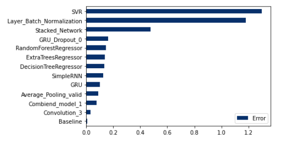
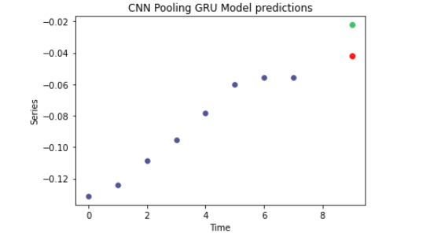

# gdp-time-series-prediction

### Description  
*This project aims to test different TensorFlow and Sklearn models with limited time series data. Many different models are created and tested against the baseline models and are compared.*

### Aim
*Build multiple TensorFlow models (with limited data) and compare them.*

### Table of Contents
* 1) [Aim](#aim)
* 2) [Items](#items)
* 3) [AI and ML models considered](#ai-and-ml-models-considered)
* 4) [Logs Visualization](#logs-visualization)
* 5) [Modules](#modules)
* 6) [Logs Visualization](#logs-visualization)
* 7) [Project with Images](#project-with-images)
* 8) [Source](#source)

### Items 
* Data Processing (Data Processing Notebook)
* Model Building (Model Building Notebook)
* Logging the training and validation performance (final_logs)

### AI and ML models considered 
* Average Pooling Convolutional Model
* Combined Model (Covolutional and GRU)
* Convolutional Model 
* GRU 
* Stacked GRU 
* GRU dropout
* Layer & Batch Normalized GRU
* LSTM 
* SimpleRNN 
* Stacked Network

### Logs Visualization 
You can visualize the logs using tensorboard. View the tensorboard documentation for support.(https://www.tensorflow.org/tensorboard)

### Modules 
* TensorFlow 
* Sklean 
* numpy 
* pandas 
* matplotlib 

### Project with Images
* TOP 5 models 

* Error Comparison 

* Best Convolutional after removing Outliers

* CNN Pooling Predictions

* LSTM  Predictions

* CNN Pooling Predictions

### Source
* 1) TensorBoard Documentation (https://www.tensorflow.org/tensorboard)
* 2) World Development Indicators Data (https://databank.worldbank.org/source/world-development-indicators)
* 3) Time Series (https://www.tensorflow.org/tutorials/structured_data/time_series)
